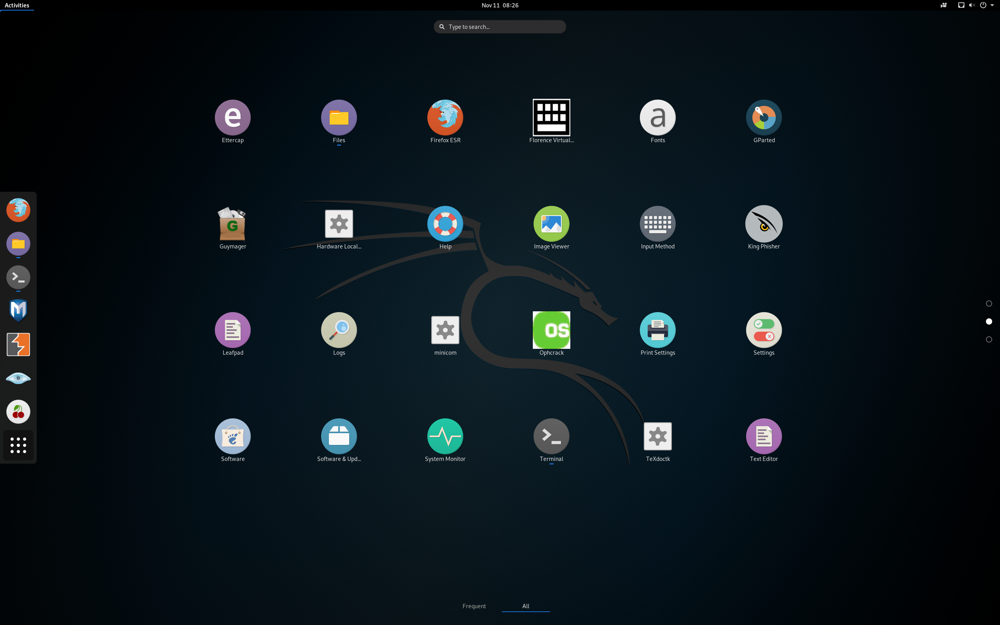
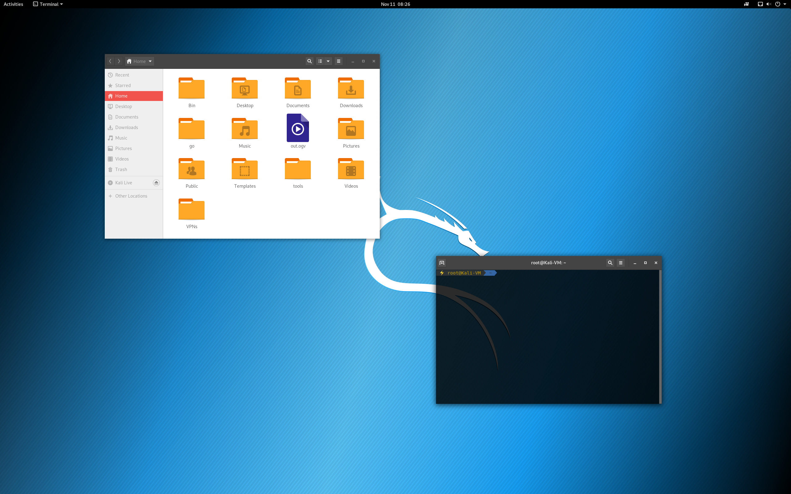

# ignition-key.kali
Ansible scripts to install tools and files wanted on a new Kali Machine. The name and the idea was taken from [John Hammond](https://github.com/JohnHammond).

## How to use
To use this repository, follow these steps on a Kali Linux machine:
1. clone the repo
2. run `install_ansible.sh`
3. run `ansible-playbook setup.yml`

This has only been tested on a new install of Kali Linux. Your mileage may differ.

## Configuration Changes
These scripts will:
- disable all Gnome extensions except for screen recorder
- Install Numix GTK Theme and make it the default
- Add keybindings
    - Internet - `<Super> + i`
    - Terminal - `<Super> + <enter>`
    - Files - `<Super> + e`
- Disable lockscreen and screensaver because VMs don't need that
- It installs docker and golang for tool purposes
- Installs openvpn gnome manager for easier access to VPNs

## Installed Tools 
The following tools will be installed:
- Anything mildly entertaining to harass people with
    - figlet
    - toilet
    - pusheen-sl.py
- Metasploit
- Empire
- impacket
- shellz
- pupy
- PHP reverse shell
- pwntools
- xautomation

## Screenshots
This list will grow as this repository is improved upon

### Icons

### Theme

## Future Work
- Setup listeners automatically
    - Have pupy and others be ready to deploy payloads and listen
- Add scripts
    - I have a list of scripts I need to write. I want to add them here so that I will always have them available

Pull requests are welcome if you want to expand upon this. 